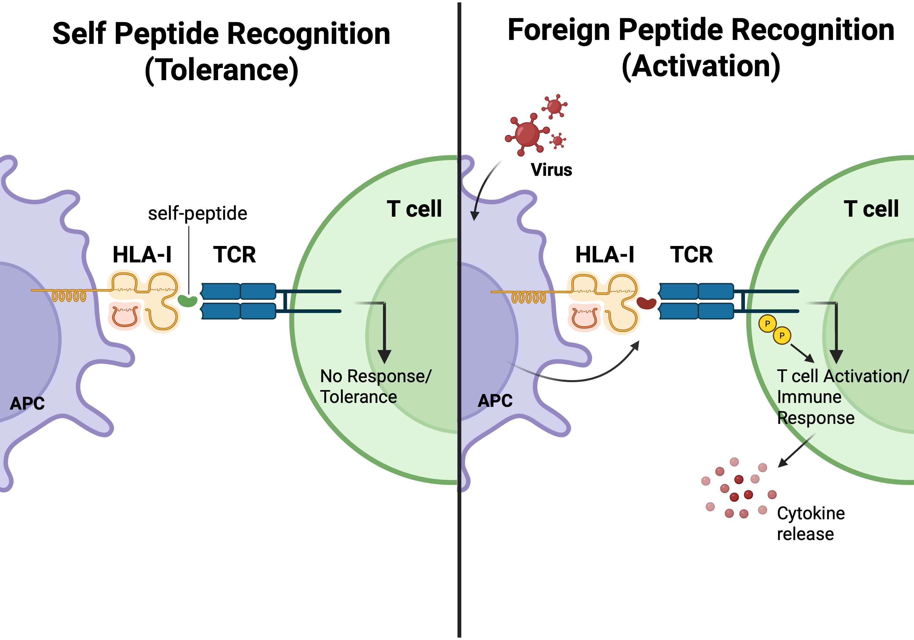

# HLAfactor



**HLAfactor** is a command-line tool for **HLA (Human Leukocyte Antigen) quality control (QC)** and **downstream immunogenetic feature analysis**.

It is designed to work with HLA imputation outputs and related genotype tables, with support for common formats such as `.txt`, `.dosage`, `.vcf`, and `.vcf.gz`.

## Author
Qijing Shen, Mathias Viard, Mary Carrington, Gavin Band† and M. Azim Ansari†


## What HLAfactor does

HLAfactor currently supports two mutually exclusive workflows:

1. **HLA QC**
   Filter HLA-region variants by genome build, allele frequency, and imputation quality.
2. **HLA downstream analysis**
   Compute immunogenetic features such as heterozygosity, expression proxies, supertypes, tapasin dependence, and NK-related ligand markers.
   The `-amac` output reports IMGT protein alignment positions in `pos`.

## Installation

Download a prebuilt binary from the GitHub releases page.

### Linux (x86_64)

```bash
wget https://github.com/QiJingS/hlafactor/releases/download/v0.0.0/hlafactor-0.0.0-Linux-x86_64.tar.gz
tar -xzf hlafactor-0.0.0-Linux-x86_64.tar.gz
cd hlafactor-0.0.0-Linux-x86_64
./bin/hlafactor
```
### macOS (arm64)

```bash
wget https://github.com/QiJingS/hlafactor/releases/download/v0.0.0/-0.0.0-Darwin-arm64.tar.gz
tar -xzf hlafactor-0.0.0-Darwin-arm64.tar.gz
cd hlafactor-0.0.0-Darwin-arm64
./bin/hlafactor
```

If you only want to see the command-line help:

```bash
./hlafactor -h
```

## Build requirements

HLAfactor is developed in **C++20** and is recommended to be built with **GCC 12.3.0** or a compatible compiler that provides solid C++20 support.

Recommended build environment:

- C++ standard: `C++20`
- Recommended compiler: `gcc/g++ 12.3.0`
- Build tool: `make`
- Bundled dependency workflow: `htslib` is built through the provided Makefile setup

You can check your compiler version with:

```bash
g++ --version
gcc --version
```

If your system default compiler is not GCC 12.3.0, you can explicitly point `make` to the compiler you want to use:

```bash
make CXX=g++-12
```

## Quick start

Run QC on a VCF input:

```bash
hlafactor -i example/example.vcf -o results -hlarg38 -af 0.01 0.5 -impr2 0.9 1.0
```

Run heterozygosity analysis on a text input:

```bash
hlafactor -i example/example.txt -o results -het
```

Run supertype assignment on a dosage input:

```bash
hlafactor -i example/example.dosage -o results -sup
```

## Basic usage

```bash
hlafactor [options]
```

## Required arguments

| Option | Description |
| --- | --- |
| `-i` | Input file (`.txt`, `.dosage`, `.vcf`, or `.vcf.gz`) |
| `-o` | Output folder or output prefix |

## Workflow 1: HLA Quality Control

Use QC mode when the input contains HLA-region variants and you want to apply coordinate-aware variant filtering.

```bash
hlafactor -i <input_file> -o <output_prefix> -hlarg38|-hlarg37 \
          [-af <min> [<max>]] [-impr2 <min> [<max>]]
```

### QC options

| Option | Description |
| --- | --- |
| `-hlarg38` | Use hg38 / GRCh38 coordinates |
| `-hlarg37` | Use hg19 / GRCh37 coordinates |
| `-af` | Filter variants by allele frequency range |
| `-impr2` | Filter variants by imputation `R^2` range |

## Workflow 2: HLA downstream analysis

Use analysis mode to derive sample-level immunogenetic features from HLA genotype or dosage input.

```bash
hlafactor -i <input_file> -o <output_prefix> [-tapasin | -het | -hetf | -exp | -sup | -lignk | -amac]
```

### Analysis modules

| Option | Description |
| --- | --- |
| `-tapasin` | Compute tapasin dependence scores for HLA-A, HLA-B, HLA-C, and a global summary |
| `-het` | Compute general HLA heterozygosity |
| `-hetf` | Compute functional heterozygosity for HLA-A, HLA-B, and HLA-C |
| `-exp` | Estimate expression-related values for HLA-A and HLA-C |
| `-sup` | Assign HLA supertypes for supported class I and class II loci |
| `-lignk` | Compute NK-related HLA markers linked to KIR ligands |
| `-amac` | Map HLA alleles to amino acid genotypes using IMGT/HLA protein alignments |

## Supported input formats

HLAfactor accepts multiple common imputation or genotype representations:

| Format | Typical use |
| --- | --- |
| `.txt` | Sample-by-feature or allele dosage table |
| `.dosage` | Dosage-style HLA imputation output |
| `.vcf` | Uncompressed VCF |
| `.vcf.gz` | bgzip-compressed VCF |

Example files are included in this repository:

- `example/example.txt`
- `example/example.dosage`
- `example/example.vcf`

## Output

Output files are generated automatically using the requested analysis type and the provided output prefix.

Typical outputs include:

| Analysis | Example output |
| --- | --- |
| QC | `sample_qc.txt` |
| Tapasin | `sample_tap_A.txt`, `sample_tap_B.txt`, `sample_tap_C.txt`, `sample_tap_global.txt` |
| Heterozygosity | `sample_heterozygosity.txt` |
| Functional heterozygosity | `sample_functional_zygosity.txt` |
| Expression | `sample_A.txt`, `sample_C.txt` |
| Supertypes | `sample_supertypes.txt` |
| NK ligands | `sample_HLA_variant_NK.txt` |
| Amino acid mapping | `sample_amino_acids.txt` |

Representative example outputs are available under `example_output/`.

## Example commands

### QC with allele frequency and imputation quality filtering

```bash
hlafactor -i example/example.vcf -o results -hlarg38 -af 0.01 0.5 -impr2 0.9 1.0
```

### General heterozygosity

```bash
hlafactor -i example/example.txt -o results -het
```

### Functional heterozygosity

```bash
hlafactor -i example/example.txt -o results -hetf
```

### Expression-related analysis

```bash
hlafactor -i example/example.txt -o results -exp
```

### Supertype assignment

```bash
hlafactor -i example/example.dosage -o results -sup
```

### NK-related ligand markers

```bash
hlafactor -i example/example.txt -o results -lignk
```

### Tapasin dependence

```bash
hlafactor -i example/example.txt -o results -tapasin
```

## Important notes

- QC options and downstream analysis options cannot be combined in the same run.
- Use exactly one workflow per command: either QC or one downstream analysis module.
- HLAfactor expects input values to be interpretable as valid HLA alleles, allele pairs, dosages, or supported variant encodings.
- Some downstream analyses require valid diploid allele pairs at specific loci, especially HLA-A, HLA-B, and HLA-C.

## Missing values and error handling

HLAfactor performs strict validation during parsing and downstream computation to improve robustness and reproducibility.

- Missing or invalid values such as `NAN`, `.`, or unmatched entries are treated as missing and propagated as `NA` in the output.
- If an allele or genotype cannot be matched to the internal reference used by HLAfactor, the corresponding result is returned as `NA` rather than forcing an incorrect value.
- For probabilistic or dosage-based imputation outputs, HLAfactor supports both hard-call style and quantitative inputs.
- When a downstream method requires a discrete genotype, dosage or probability values may be rounded internally to the nearest callable genotype.
- For supertype-related output, dosage-style values may be retained to preserve more of the original imputation information.
- When alleles or allele pairs cannot be matched to the internal reference panel, HLAfactor may generate an additional mismatch report containing the sample ID, gene/locus, and unmatched allele or genotype.

## Included reference resources

This repository includes internal reference tables used by the software, for example:

- `data_input/tapasin.txt`
- `data_input/expression.txt`
- `data_input/superA.txt`
- `data_input/superB.txt`
- `data_input/super_class_II.txt`

## Features

- Flexible support for multiple HLA input formats
- Modular command-line workflow
- Built-in QC filtering
- Automatic output naming
- Multiple immunogenetic feature modules
- Support for both hard-call and dosage-style HLA data

## Repository layout

| Path | Description |
| --- | --- |
| `code/` | Source code and packaged binaries |
| `data_input/` | Internal reference tables used by analyses |
| `example/` | Example input files |
| `example_output/` | Example output files |

## Citation

If you use HLAfactor in a publication, please cite the associated manuscript or software release when available.

## License
MIT

## Acknowledgements

Thanks to all contributors, collaborators, and users who helped test and improve HLAfactor.
